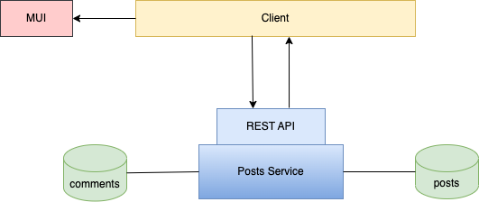

# Vision & Idea

The vision is to create an application for people who need to ventilate their feelings and thoughts. The application should be like an anonymous private diary shared with the world. The aim is for people to have a place where they could turn to if they need to feel less lonely. The user should be able to read posts created by others and create posts themselves without needing to create an account if they don't want to. The focus and theme should be on mental health.

The goal is to create an application and a community that is anonymous and safe and where the posts stays on topic and where the guidelines are followed.

Suggestions for future implementation:
- Having admin accounts for post moderation.
- Adding the possibility for users to report posts not following the guidelines.
- Automatic scanning of newly created posts using AI.

# Technology
The application is built with the MERN technology stack (MongoDB, Express, React, Node), Mongoose as ODM and MUI components (https://mui.com/). The components is written as React class components.

# Prior knowledge
To contribute to the project, knowledge of the technology used in the application as well as React class components is a prerequisite.

Learn about React:
https://reactjs.org/docs/getting-started.html

Learn about React class components:
https://www.w3schools.com/react/react_class.asp
https://reactjs.org/docs/components-and-props.html
https://www.pragimtech.com/blog/reactjs/introduction-to-class-components-in-react/
https://www.geeksforgeeks.org/reactjs-class-based-components/

Learn about Node:
https://nodejs.dev/en/learn/

Learn about Express:
https://expressjs.com/

Learn about MongoDB:
https://www.mongodb.com/docs/

Learn about Mongoose:
https://mongoosejs.com/

Learn about MUI:
https://mui.com/

# System Design

# Requirements

Requirements specification can be found here: requirements.md

When adding a new feature, please add it to the requirements specification if it's not there already.

# Testing

The test specification can be found here: test-specification.md.
The testing is done with manual test cases and test reports can be found here: testreports/

When adding a new feature, make sure to add the tests and document the testing by adding a test report in the test reports folder.

# Contributing

- Fork the project
- Install dependencies (`npm install`) on both server and client
- Add neccessary environment variables for the server (see here)
- Add neccessary environment variables for the client (see here)
- Create a new feature branch.
- Add your new feature to the requirements specification.
- Add tests to your feature (if manual, add them to the test specification)
- Document the tests in a test report and add it to the test report folder.
- Create a pull request
