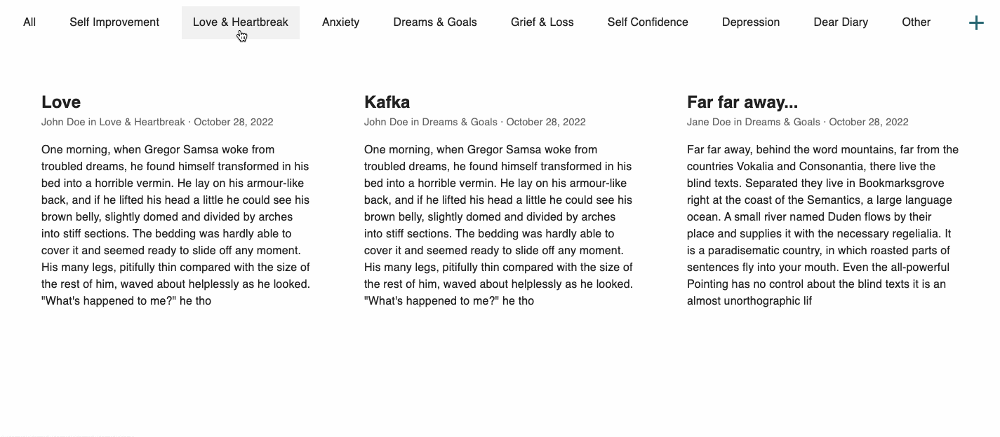
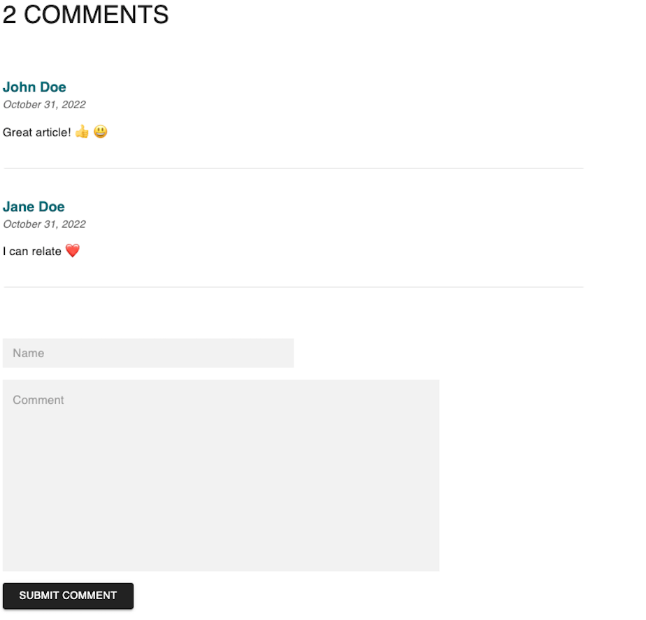
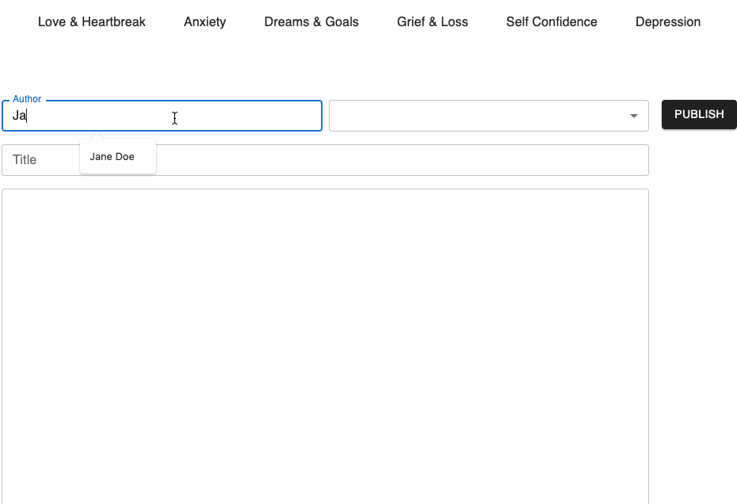

# DEAR WORLD APP

#### ** ***BETA VERSION*** **

Dear World App is a global journal online where you can share your thoughts and feelings with the world. It's completely anonymous and you don't need to create an account.

Come here to share your inner thoughts and read posts written by others.

Share, Relate and Support. On Dear World App, you are not alone!

https://dearworldapp.netlify.app/ 

## ON DEAR WORLD APP YOU CAN...

### Read posts
Read posts created by people from all over the world. Whenever you're feeling alone in the world, read pieces written by others and feel comfort in knowing that someone else goes through something similar. Find your support.

### Sort posts by subject
Sort posts depending on subject. What are you feeling today? 

### Comment on posts (in the current beta version, you need to update the page to see your comment)
Love bomb the ones that share their thoughts and feelings with you. Remember, they are heroes! They help to cure the world from loneliness!

### Create your own posts
Have something to share? Need to write something of your chest? On Dear World, you don't need to create an account to publish a post. Just click on the add button, chose a subject and start writing.

## Prefer to run the application locally?

1. Clone the repository in a folder of your choice (`git clone git@github.com:emiliaajax/dear-world.git`)
2. Follow the instructions to start the server application [HERE](https://github.com/emiliaajax/dear-world/blob/main/server/README.md).
3. Follow the instructions to start the client application [HERE](https://github.com/emiliaajax/dear-world/blob/main/client/README.md). 
