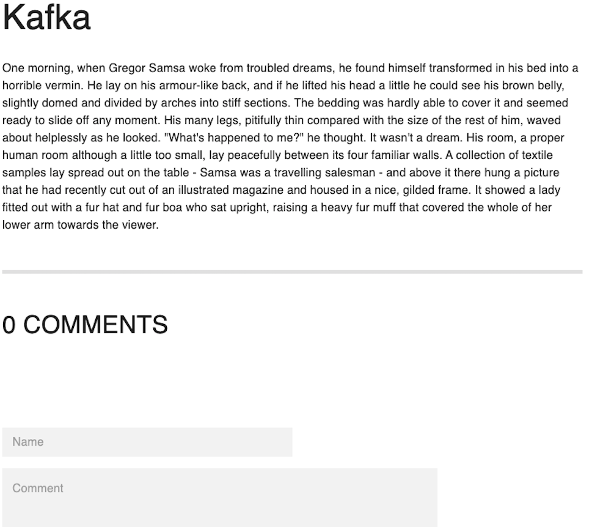

# DEAR WORLD APP

Dear World App is a global journal online where you can share your thoughts and feelings with the world. It's completely anonymous and you don't need to create an account.

Come here to share your inner thoughts and read posts written by others.

Share, Relate and Support.

https://dearworldapp.netlify.app/

## On Dear World App you can...

### Read posts

### Sort posts by category

### Love bomb with comments (update the page to see your comment)

### Create your own posts

## Prefer to run the application locally?

1. Clone the repository in a folder of your choice (`git clone git@github.com:emiliaajax/dear-world.git`)
2. Follow the instructions to start the server application [HERE](https://github.com/emiliaajax/dear-world/blob/main/server/README.md).
3. Follow the instructions to start the client application [HERE](https://github.com/emiliaajax/dear-world/blob/main/client/README.md). 
