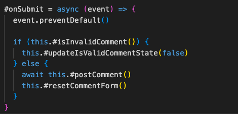
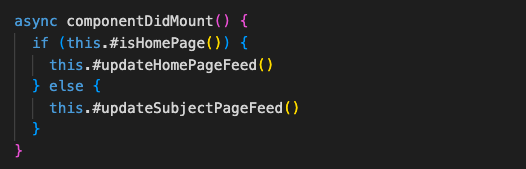

### Meaningful Names
Jag har följt 

### Functions
Det här kapitlet har varit en ögonöppnare som, enligt mig själv, har gjort min kod mer ren. Jag har försökt följa rådet om att ha *One Level of Abstraction per Function* och tycker själv att jag har utvecklats under kursens gång och att slutresultatet har blivit ganska bra. Det är inte perfekt, men kvaliteten på min kod är betydligt bättre än innan jag läste den här kursen. 

När jag har gått efter rådet om att ha en abstraktionsnivå per funktion så tycker jag att råden om att funktionerna ska vara så små som möjligt (*Small!*) och att de ska göra en sak (*Do One Thing*) per automatik har uppfyllts. Det har resulterat i att mina metoder alla är under 10 rader (när man räknar bort mellanrum och radbrytningar som är gjorda för läsbarhetens skull).

Två exempel, från klientkoden i L2, på metoder av hög abstraktionsnivå:

### Comments
När det gäller kommentarer har jag försökt utmana mig själv. I tidigare kurser har vi varit tvungna att skriva kommentarer till varje metod och det är svårt att bryta sig ur det tankesättet. Men nu har jag försökt att fullt ut gå efter *Explain Yourself in Code* och bokens devis om att minimera kommentarer.

I L1 använder jag mig av JSDoc-kommentarer främst för att tala om typer på parametrar och returvärden och istället för att skriva en tilläggskommentar som beskriver koden har jag fokuserat på att ge beskrivande namn. 

I L2 på klientsidan har jag tagit det steget längre och har på många ställen utelämnat kommentarer helt där jag inte tycker att det behövs. Som nämnt så tar det emot av ren vana men efter att ha läst boken och i tillägg läst om best practices för att kommentera React komponenter (där många faktiskt refererar till Clean Code och skriver att kommentarer förstör det naturliga flödet när man skriver komponenter i React) så har jag valt att endast kommentera där jag verkligen tycker att det behövs. Jag har bland annat använt mig av *Explanation of Intent*-kommentarer om en nödlösning som användes på flera ställen när inget annat fungerade.

På serversidan har jag valt att ha fulla JSDoc-kommentarer och även radkommentarer i konfigurationer då jag själv tycker att det kräver mer som inte namngivning eller koden förklarar.

Jag har försökt balansera mellan boken och de olika konventionerna för namngivning i både React och Express.

### Formatting
I har jag gått efter the Newspaper Metaphor när jag skrivit min kod. Att det viktigaste och mest övergripande kommer först och det detaljerade sist, och att man ska kunna läsa uppifrån och ner i ett naturligt flöde. 

Jag har tänkt mycket på *Vertical Distance* och att metoder som är nära relaterade ska ligga nära varandra vertikalt sett. Jag har också följt råden om *Vertical Openness/Density* och tycker att koden blir betydligt mer lätt att överskåda med de reglerna.

I L1 har jag valt att ha de publika metoderna överst och därefter de privata metoderna. Varje klass, förutom klassen som tillhandahåller det publika interfacet, har bara en eller två publika metoder och distansen mellan tätt associerade metoder är därmed inte för stor. Huvudklassen har ett flertal som jag har valt att lägga överst för att en utvecklare lätt ska kunna få en översikt vilka funktioner som tillhandahålls för användaren. Därefter har jag efter bästa förmåga försökt lägga de privata metoderna så att distansen inte lir för stor vertikalt sett bort vertikalt sett. 

I L2 har jag fått kompromissa med vad som förväntas när man ska skriver React-komponenter. I klassbaserade komponenter som jag skriver är det förväntat att den publika render-metoden ligger längst ner. Utöver det har jag gått efter Newspaper Metaphor och lagt det viktigaste överst. I vissa fall har jag en componentDidMount-metod som finns i React-klasser och som förväntas ligga överst vilket den också gör. Det här har gjort att den vertikala distansen mellan render-metoden och vissa metoder den anropar vid användarinteraktion har blivit ganska stor. Jag provade först att göra en omvänd Newspaper Metaphor (det vill säga att det läses uppifrån och ner) men det kändes inte naturligt. Istället valde jag att gå  efter Newspaper Metaphor med undantag för render-metoden som ligger allra längst ner i klasskomponenten.

### Objects And Data Structures
Jag har strävat efter att ha objekt med privata variabler och metoder som anropas. I komponenterna har jag dock en state-variabel som är publik. När den sätts privat uppdateras inte komponenterna. Jag följer *The Law of Demeter* och anropar endast metoder på de sätt som som tillåts enligt den.  

### Error Handling
Jag har gått från att jobba med booleans i min validering och har istället, efter att ha läst boken och sett föreläsningarna, börjat kasta exceptions istället. Genom att göra på det sättet upplever jag att det är lättare att separera koden så att varje metod bara gör en sak. Jag upplever också att det blir färre metoder med nästlade loopar och if-satser. Här är ett exempel på validering som görs i L1:

### Boundaries
På klienten i L2 använder jag mig av ett paket för att formattera datum. Jag importerade först paketet direkt i komponenterna där de användes, men efter att ha läst kapitelavsnittet *Using Third-Party Code* valde jag att skapa en DateFormatter-klass som importerar paketet och istället ha en publik metod som formatterar datum på det sätt jag önskar göra i applikationen. Det minskar kodupprepning för det första, men ökar också kontroll ifall ändringar i paketet orsaker ändringar i beteende. Detta kan enkelt kontrolleras med automatiska enhetstester (som jag tyvärr inte hann lägga till i L2).

### Unit Tests
Jag har använt mig av enhetstester i L1 och tycker själv att de är läsbara. Jag tycker också att jag uppfyller rådet om *Single Concept per Test* då jag testar en enda sak per test och inte testar flera olika saker samtidigt. Efter att ha läst igenom *F.I.R.S.T* tycker jag också att mina enhetstester uppfyller de flesta punkterna ganska bra. Testen är enligt vad jag uppfattar som snabba, de är inte beroende av varandra och behöver inte utföras i en specifik ordning, och de är självvaliderande. 

### Classes
Mina klasser och komponenter i L1 och L2 är små och jag anser själv att det de inte har för mycket ansvar utan följer The Single Responsibility Principle. Däremot är en av komponenterna i testappen väldigt stor med många variabler och eventhanterare vilket är en tydlig indikation på att den har för mycket ansvar. Jag har tidigare försökt att flytta ut kod till flera komponenter, men det har orsakat problem med hur jag ska hantera states (vilket ramverk som React underlättar mycket). Jag valde att lämna det då jag inte kunde hitta en lösning på problemet.

### Systems

