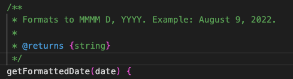
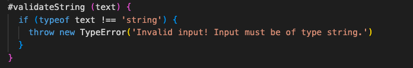
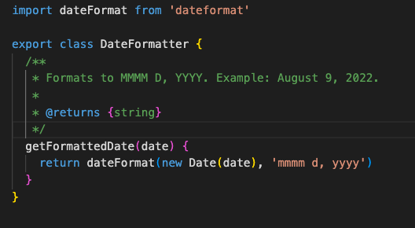
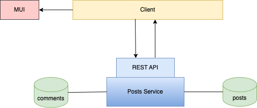

### Meaningful Names
Jag har försökt följa de flesta råden i boken för namngivning och har främst fokuserat på att namnen ska vara *Intention Revealing*, *Pronouncable* och *Searchable* och har inte varit rädd för att ha långa namn om det behövs. 

Jag har  använt ord från problem- eller lösningsdomänen och jag har även använt subjektiv som klassnamn och verb som metodnamn. 

Viss namngivning följer konventioner för webbkomponenter. Exempelvis metodnamn som `onChange()` och `onSubmit()`, samt namngivning för vissa metoder på serversidan. Jag har försökt balansera mellan boken och de olika konventionerna för namngivning i ramverken för både React och Express.

### Functions
Det här kapitlet har varit en ögonöppnare som, enligt mig själv, har gjort min kod mer ren. Jag har försökt följa rådet om att ha *One Level of Abstraction per Function* och tycker själv att jag har utvecklats under kursens gång och att slutresultatet har blivit ganska bra. Det är inte perfekt, men kvaliteten på min kod är betydligt bättre än innan jag läste den här kursen. 

När jag har gått efter rådet om att ha en abstraktionsnivå per funktion så tycker jag att råden om att funktionerna ska vara så små som möjligt (*Small!*) och att de ska göra en sak (*Do One Thing*) per automatik har uppfyllts. Det har resulterat i att mina metoder alla är under 10 rader (när man räknar bort mellanrum och radbrytningar som är gjorda för läsbarhetens skull).

Exempel från klientkoden i L2 på en metod av hög abstraktionsnivå:

Jag tror dessvärre att jag har, om jag förstått rätt, sidoeffekter i en metod i L1. Detta kom sig av att jag började dela upp koden i mindre metoder från en metod som var djupt nästlad samtidigt som jag försökte skapa metoder som inte har några argument (för att citera boken: *"The ideal number of arguments for a function is zero"*). I exemplet nedan uppdaterar jag den nuvarande emojin och den nuvarande emoticon. Detta påverkar dock egentligen ingenting men jag är osäker på om det potentiellt skulle kunna skapa problem. Jag anser dock inte att det är en ändring som är oväntad.

### Comments
När det gäller kommentarer har jag försökt utmana mig själv. I tidigare kurser har vi varit tvungna att skriva kommentarer till varje metod och det är svårt att bryta sig ur det tankesättet. Men nu har jag försökt att fullt ut gå efter *Explain Yourself in Code* och bokens devis om att minimera kommentarer.

I L1 använder jag mig av JSDoc-kommentarer för metoderna i det publika interfacet då att kommentera publika API är ansett som en bra kommentar enligt kapitelavsnittet *Good Comments*.

Annars använder jag JSDoc främst för att tala om typer på parametrar och returvärden, och istället för att skriva en tilläggskommentar som beskriver koden har jag fokuserat på att ge beskrivande namn.

I L2 på klientsidan har jag tagit steget längre och har på de flesta ställen utelämnat kommentarer helt där jag inte tycker att det verkligen behövs. Som nämnt så tar det emot av ren vana men efter att ha läst boken och i tillägg läst om best practices för att kommentera React komponenter (där många faktiskt refererar till Clean Code och skriver att kommentarer förstör det naturliga flödet när man skriver komponenter i React) så har jag valt att endast kommentera där jag verkligen tycker att det behövs. Jag har bland annat använt mig av *Explanation of Intent*-kommentarer om en nödlösning som användes på flera ställen i min kod (en lösning som jag läste inte var så bra praxis att använda sig av) när inget annat fungerade.

I tillägg har jag också valt att ha informativa kommentarer på vissa ställen där jag ger information/exempel som inte kan uttryckas i ett metodnamn.

På serversidan har jag valt att ha fulla JSDoc-kommentarer och även radkommentarer i konfigurationer. Radkommentarerna kanske skulle kunna klassas som redundanta enligt Clean Code, men i och med att jag själv har svårt att komma ihåg vad konfigurationerna innebär så valde jag att ha kvar det. 

Exempel på en radkommentar i server.js:

Exempel på en radkommentar i controller.js:

### Formatting

Jag har försökt gå efter *The Newspaper Metaphor* när jag skrivit min kod. Att det viktigaste och mest övergripande kommer först och det detaljerade sist, och att man ska kunna läsa uppifrån och ner i ett naturligt flöde.

Se exempel från klientkoden i L2 nedan. I exemplet ser man hur det viktigaste och mest abstrakta ligger längst upp, och det mest detaljerade längre ner (metoden som inte är med finns längre upp i koden då den används av en annan metod). Jag har även tänkt mycket på *Vertical Distance* och att metoder som är nära relaterade ska ligga nära varandra vertikalt sett när jag gått igenom koden.

 Jag har också följt råden om *Vertical Openness/Density* och tycker att koden blir betydligt mer lätt att överskåda med de reglerna. Se exempel:

I L1 har jag valt att ha de publika metoderna överst och därefter de privata metoderna. Varje klass, förutom klassen som tillhandahåller det publika interfacet, har bara en eller två publika metoder och distansen mellan tätt associerade metoder är därmed inte för stor. Huvudklassen har ett flertal publika metoder som jag har valt att lägga överst för att en utvecklare av biblioteket lätt ska kunna få en översikt över vilka funktioner som tillhandahålls för användaren. Därefter har jag efter bästa förmåga försökt lägga de privata metoderna så att distansen inte blir för stor vertikalt sett.

I L2 har jag fått kompromissa med vad som förväntas för klassbaserade React-komponenter och vad boken säger. I klasskomponenterna är det förväntat att den publika render-metoden ligger längst ner. Utöver det har jag gått efter *The Newspaper Metaphor*. Det här har gjort att den vertikala distansen mellan render-metoden och vissa metoder den anropar vid användarinteraktion har blivit ganska stor. Jag provade först att göra en omvänd Newspaper Metaphor (det vill säga att det läses nerifrån och upp) men det kändes inte naturligt. Istället valde jag att göra som boken rekommenderar med undantag för render-metoden som får ligga kvar allra längst ner i klasskomponenten. 

### Objects And Data Structures
Jag skulle inte klassa mina klasser som datastrukturer då jag använder mig av privata variabler och publika metoder som anropas. I komponenterna har jag dock en state-variabel som är publik. Om den sätts privat uppdateras nämligen inte komponenterna. 

Exempel från L1:

Exempel från L2:

Jag följer *The Law of Demeter* och anropar endast metoder på de sätt som tillåts enligt den.  

### Error Handling
Jag har gått från att jobba med booleans i min validering och har istället, efter att ha läst boken och sett föreläsningarna, börjat kasta exceptions istället. Genom att göra på det sättet upplever jag att det är lättare att separera koden så att varje metod bara gör en sak. Jag upplever också att det blir färre metoder med nästlade loopar och if-satser. 

Här är ett exempel på validering som görs i L1:

### Boundaries
På klienten i L2 använder jag mig av ett paket för att formattera datum. Jag importerade först paketet direkt i komponenterna där de användes, men efter att ha läst kapitelavsnittet *Using Third-Party Code* valde jag att skapa en DateFormatter-klass som importerar paketet och istället ha en publik metod som formatterar datum på det sätt jag önskar göra i applikationen. Det minskar kodupprepning för det första, men ökar också kontroll ifall ändringar i paketet orsaker ändringar i beteende eftersom detta enkelt kan kontrolleras med automatiska enhetstester (som jag tyvärr inte hann lägga till i L2).

Jag har även annan tredjeparts-kod jag använder mig av. Exempelvis ramverken Express och React. En idé vore att, som boken föreslår i kapitelavsnittet *Exploring and Learning Boundaries*, lära sig koden noggrant genom att skriva tester för dem.

### Unit Tests
Jag har använt mig av enhetstester i L1 och tycker själv att de är läsbara. Jag tycker också att jag uppfyller rådet om *Single Concept per Test* då jag testar en enda sak per test och inte testar flera olika saker samtidigt. 

Efter att ha läst igenom *F.I.R.S.T* tycker jag också att mina enhetstester uppfyller de flesta punkterna ganska bra. Testen är enligt vad jag uppfattar som snabba, de är inte beroende av varandra och behöver inte utföras i en specifik ordning, och de är självvaliderande. 

Jag hann tyvärr inte skriva automatiska enhetstester för L2 då jag inte har lärt mig hur man ska göra för att hantera databaser.

### Classes
Mina klasser och komponenter i L1 och L2 är små och jag anser själv att det de inte har för mycket ansvar utan följer *The Single Responsibility Principle*. 

Däremot är en av komponenterna i testappen i L1 väldigt stor med många variabler och eventhanterare vilket är en tydlig indikation på att den har för mycket ansvar. Jag har tidigare försökt att flytta ut kod till flera komponenter, men det har orsakat problem med hur jag ska hantera states (vilket ramverk som React underlättar mycket). Jag valde att lämna det då jag inte kunde hitta en lösning på problemet.

Detta exempel är för att visa hur lång konstruktorn i en komponent i testappen är:

Det här är något jag är medveten om inte är något som är så bra, men som jag tyvärr inte lyckades göra något åt.

I övrigt skulle jag påstå att mina klasser och komponenter har både low coupling och high cohesion.

### Systems

Jag anser att jag har en väl uppdelad systemarkitektur som tar hänsyn till *Separation of Concerns* och *Optimize Decision Making*.

Serversidekoden är helt separerad från klientsidekoden. Se arkitektur:

På serversidan är koden (förutom konfigurationer) uppdelad i models, controllers och routes som har varsitt ansvarsområde.

På klientsidan är koden uppdelad i komponenter, där varje komponent endast ansvarar för det som sker inuti den komponenten. Jag har även separerat anrop till API från komponenterna så att detta görs i separata klasser. Jag har också en `utils`-mapp med klasser som ansvarar för vissa funktioner som till exempel, i detta fall, formattering av datum och enums.

I `index.html` importeras endast `index.js` som endast importerar komponenten `App`. I `App`-komponenten sätts därefter alla routes upp.

Detta gör att det är möjligt att skala upp (*Scaling Up*) relativt smärtfritt. För att skala upp på serversidan kan flera services läggas till så att man bygger upp det som en microservice-arkitektur, alternativt kan man lägga till fler models, controllers och routes utan att behöva ändra i konfigurationen i den existerande servicen. Fler klasser kan skapas på klienten som anropar APIerna och komponenter kan läggas till med ny funktionalitet genom att lägga till den med en route i `App`-komponenten exempelvis.
